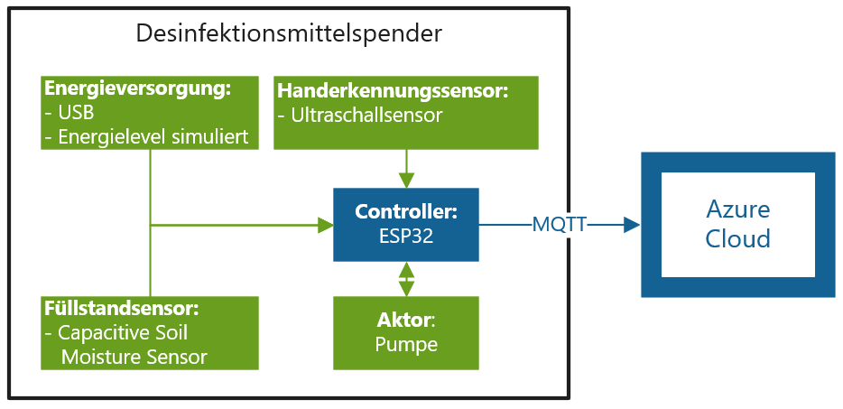

# IoT_Dispender for Kete Project
Source Code for the Prototyp with ESP32, Ardruino and Azure
## Overview Prototyp:


## Configuration which has to be changed
```
const char* ssid     = "SSID";
const char* password = "password";
static const char* connectionString = "HostName=<host_name>;DeviceId=<device_id>;SharedAccessSignature=<device_sas_token>";
```
## Configuration which can be changed
```
// Generel Configuration
int sendDataInterval = 200;
int pumpRunTime = 2000;

// Liqud level calibration
const int minLiquidLevel = 3500;
const int maxLiquidLevel = 300;

// Ultrasonicsensor calibration
const int aktivatePumpDistance = 20;
```
 
